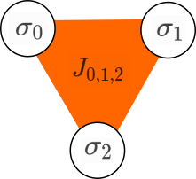

Ising Wrapper for QAOA
======================

Overview
--------

Ising QAOA is a wrapper for the
`quantum approximate optimization algorithm <http://grove-docs.readthedocs.io/en/latest/qaoa.html>`_
that makes it easy to work within the framework of Ising-type Hamiltonians
with binary variables \\( \\sigma_{k} \\in \\{+1, -1\\} \\).

This wrapper is particulary useful for people that have been working with quantum annealers
in the past. However, in comparison to current quantum annealers the Ising QAOA wrapper
supports not only 2-local but also k-local interaction terms and the driver (mixer)
Hamiltonian is not dictated by the hardware but can be defined by the user.

For each Ising instance the user specifies the bias terms \\( h_{i} \\), the
interaction tensor \\( J_{i,j,..,k} \\) and the approximation order of the algorithm.
``ising_qaoa.py`` contains routines for approximating the ground state of
the specified Ising-type Hamiltonian through the use of QAOA which itself
finds the optimal rotation angles via Grove's
`variational-quantum-eigensolver method <http://grove-docs.readthedocs.io/en/latest/vqe.html>`_.

.. _quickstart-example:

Quickstart Example
-------------------

To test your installation and get going we can run Ising QAOA for
a very simple Ising Hamiltonian: the 2D checkerboard.
(for a detailed explanation see :ref:`2d-checkerboard`)
In your python script import the packages and connect to your QVM:

.. code-block:: python

    import pyquil.api as api
    from grove.ising.ising_qaoa import ising_qaoa
    qvm_connection = api.QVMConnection()

Next we define the appropriate bias and interaction terms of the Ising Hamiltonian
for the checkerboard problem:

.. code-block:: python

    J = {(0, 1): 1, (0, 2): 1, (1, 3): 1, (2, 3): 1}
    h = {0: -1, 1: 1, 2: 1, 3: -1}

There are plenty of optional configuration parameters for the algorithm but the two
most important are the number of steps to use for the trotterization (roughly corresponds to
the accuracy of the optimization) and the driver Hamiltonian (which determines how the
state space is searched). We instantiate the algorithm and run the optimization routine on our QVM:

.. code-block:: python

    steps = 2
    solution_string, ising_energy, _  = ising_qaoa(h=h, J=J, num_steps=steps)
    print(f'The algorithm returned {solution_string} with an energy of {ising_energy}')

When running this routine you should observe the expectation value converging towards -8.0
and the solution with the highest probability should be \\( [1, -1, -1, 1] \\) with an energy of \\( -8.0 \\).

We can verify this by running the Ising QAOA multiple times and collecting statistics.
To do this, replace the last line of the last code block with:

.. code-block:: python

    runs = 10
    stats = dict()
    for _ in range(runs):
        solution_string, ising_energy, _  = ising_qaoa(h=h, J=J, num_steps=steps)
        if tuple(solution_string) in stats.keys():
            stats[tuple(solution_string)] += 1
        else:
            stats[tuple(solution_string)] = 1
    print(f'Solution statistics: {stats}')

You should see that the algorithm returns the aforementioned solution with ~99% probability (unless the classical minimizer got stuck in a local minima).

Algorithm and Details
---------------------

Introduction
~~~~~~~~~~~~

The Ising model is a very famous mathematical model by physicist Ernst Ising that was originally developed
to model ferromagnetism in statistical mechanics. The Ising model can be written as a
quadratic function of a set of spins \\( \\sigma_{i} = \\pm\, 1 \\):

$$\\mathbf{H}(\\sigma_{i},...,\\sigma_{N}) = - \\sum_{i<j}^{N} J_{i,j} \\sigma_{i} \\sigma_{j} - \\sum_{i=1}^{N} h_{i} \\sigma_{i}$$

where \\( J_{i,j} \\) is the interaction for any two adjacent sites \\( i, j \\) and \\( h_{i} \\)
is an external magnetic field interacting with the spins. Ising Hamiltonians are often also called
spin glasses even though historically the word spin glass refers to the Ising model without bias terms
as in the Edwards-Anderson model [`1 <http://iopscience.iop.org/article/10.1088/0305-4608/5/5/017/meta>`_]:

$$\\mathbf{H}(\\sigma_{i},...,\\sigma_{N}) = - \\sum_{i<j}^{N} J_{i,j} \\sigma_{i} \\sigma_{j} $$

Nowadays, the two names are used synonymously so just remember that spin glass and Ising model are the same thing!

The important difference to business-as-usual is that the spin variables \\( \\sigma_{i} \\) are binary variables
from the set \\( \\{-1, +1\\} \\) and not from \\( \\{0, 1\\} \\). In the latter case, you are not dealing with an
Ising problem but a quadratic unconstrained binary optimization (QUBO) problem. You can change from one representation
to the other using the transformation:

$$ x_{i} = \\frac{1}{2} (1 - \\sigma_{i}) $$

where \\( x_{i} \\) and \\( \\sigma_{i} \\) are QUBO and Ising variables respectively.

Since 1982 [`2 <http://iopscience.iop.org/article/10.1088/0305-4470/15/10/028/meta>`_]
we know that finding the ground state of a two-dimensional Ising model without magnetic field lies
in the complexity class \\( P \\). However, as soon as you turn on that external magnetic field
you find yourself in the complexity class \\( NP \\) when trying to find the ground state and that's why
we are in desperate need for quantum computers to help us explore the energy landscape more efficiently! But
keep in mind that there is no proof that quantum computers can solve these types of problems in polynomial time...

One of the reasons for the Ising model's popularity is the fact that many NP problems, such as number and graph partitioning or 3SAT, can be mapped to
it as discussed in e.g. [`3 <https://www.frontiersin.org/articles/10.3389/fphy.2014.00005/full>`_].

This Ising QAOA wrapper automatically generates the cost Hamiltonian for the QAOA based on the provided
biases \\( h_{i} \\) and interaction terms \\( J_{i,j} \\). It operates with binary variables from the
set \\( \\{-1, +1\\} \\) and calculates the energy of the solution string.
Using either the QVM or the QPU, it can be used as a stand alone optimizer or a plugin
optimization routine in a larger environment.  The usage pipeline is as follows:
1) formulate your problem in terms of an Ising model,
2) instantiate Ising QAOA with \\( h \\) and \\( J \\),
3) retrieve ground state solution by sampling.

The following sections give three concrete examples of how to use the
Ising QAOA wrapper to approximate ground states of various Hamiltonians.

.. _2d-checkerboard:

2-local Checkerboard Example
~~~~~~~~~~~~~~~~~~~~~~~~~~~~

Before we try to create a checkerboard pattern, let's quickly think about the interaction or coupling term.
Consider two spins \\( \\sigma_{i} \\) and \\( \\sigma_{j} \\) and their 2-local interaction term \\( J_{i,j} \\):

Suppose there are no biases on spins \\( i \\) and \\( j \\) and the coupling is \\( J_{i,j} = -1 \\).
Which values of \\( \\sigma_{i} \\) and \\( \\sigma_{j} \\) minimize the energy? Both spins should have the same
value, either +1 or -1, in order to get an overall energy of -1. Hence, a negative coupling term *correlates* spins!

If the coupling is \\( J_{i,j} = +1 \\) the energy is minimized when the two spins have opposite values.
Thus, a positive coupling *anti-correlates* spins!

Now consider the following two-dimensional graph with spins \\( \\sigma_{0}, \\sigma_{1}, \\sigma_{2}, \\sigma_{3}\\):

Let's define that we colour vertex \\( i \\) black if \\( \\sigma_{i} = -1 \\) and white if \\( \\sigma_{i} = +1 \\).
The goal is to create a checkerboard pattern with the four vertices in the graph. There is various ways of defining
\\( h \\) and \\( J \\) to achieve this result. There are two possible solutions to this problem:

The example used in the :ref:`quickstart-example` is one way of doing it. However, it involved bias terms which
strongly biased for solution nr. 2. This time we want don't care which solution we get as long as it is a valid
solution. Hence, we don't use any bias terms and only anticorrelate each pair of neighbouring spins:

.. code-block:: python

    import pyquil.api as api
    from grove.ising.ising_qaoa import ising_qaoa
    qvm_connection = api.QVMConnection()

    J = {(0, 1): 1, (0, 2): 1, (1, 3): 1, (2, 3): 1}
    h = {}

Given this Ising problem, we run the QAOA algorithm with two \\( \\beta \\) and two \\( \\gamma \\) parameters (``steps=2``).
We run it ten times in order to collect some statistics:

.. code-block:: python

    steps = 2
    runs = 10
    stats = dict()
    for _ in range(runs):
        solution_string, ising_energy, _  = ising_qaoa(h=h, J=J, num_steps=steps)
        if tuple(solution_string) in stats.keys():
            stats[tuple(solution_string)] += 1
        else:
            stats[tuple(solution_string)] = 1
    print(f'Solution statistics: {stats}')

You should get the two possible solution strings \\( [-1, 1, 1, -1] \\) and \\( [1, -1, -1, 1] \\)
with roughly equal probabilities and an energy value of \\( -4.0 \\) each.

3-local Triangle Example
~~~~~~~~~~~~~~~~~~~~~~~~

To illustrate the use of Ising QAOA with k-local interaction terms we will now consider a triangular graph.
This time we are dealing with 3 spins \\( \\sigma_{0}, \\sigma_{1}, \\sigma_{2}\\):

where the orange plane represents the 3-local interactions \\( J_{0,1,2} \\). The goal is to colour the graph
such that it looks like this:

Let's again define that we colour vertex \\( i \\) black if \\( \\sigma_{i} = -1 \\) and white if \\( \\sigma_{i} = +1 \\).
To get the desired colouring we define a strongly negative 3-local interaction term \\( J_{0,1,2} \\). This ensures that
either all vertices are coloured white or two vertices are coloured black. In order to incentivize the latter,
we set the following biases on \\( \\sigma_{0} \\) and \\( \\sigma_{1}\\):

.. code-block:: python

    import pyquil.api as api
    from grove.ising.ising_qaoa import ising_qaoa

    qvm_connection = api.QVMConnection()

    J = {(0, 1, 2): -3}
    h = {0: 1, 1: -1}

We can now run the algorithm ten times with step size 2 to collect statistics (this might take a couple of minutes):

.. code-block:: python

    steps = 2
    runs = 10
    stats = dict()
    for _ in range(runs):
        solution_string, ising_energy, _  = ising_qaoa(h=h, J=J, num_steps=steps)
        if tuple(solution_string) in stats.keys():
            stats[tuple(solution_string)] += 1
        else:
            stats[tuple(solution_string)] = 1
    print(f'Solution statistics: {stats}')

The majority of the results should be the correct solution string \\( [-1, 1, -1 ] \\) (with energy -5.0).

Source Code Docs
----------------

Here you can find documentation for the different functions of Ising QAOA.

grove.ising.ising_qaoa.ising_qaoa
~~~~~~~~~~~~~~~~~~~~~~~~~~~~

.. autofunction:: grove.ising.ising_qaoa.ising_qaoa

grove.ising.ising_qaoa.ising_trans
~~~~~~~~~~~~~~~~~~~~~~~~~~~~~~~~~~

.. autofunction:: grove.ising.ising_qaoa.ising_trans

grove.ising.ising_qaoa.energy_value
~~~~~~~~~~~~~~~~~~~~~~~~~~~~~~~~~~~

.. autofunction:: grove.ising.ising_qaoa.energy_value
