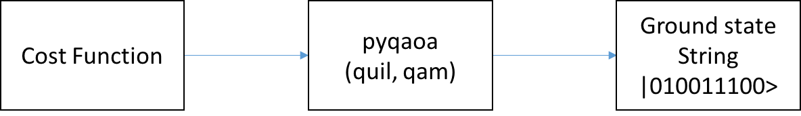
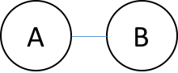
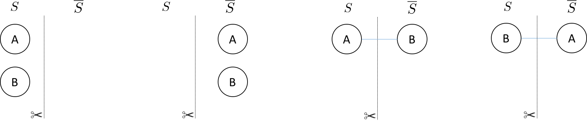
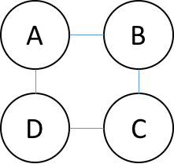
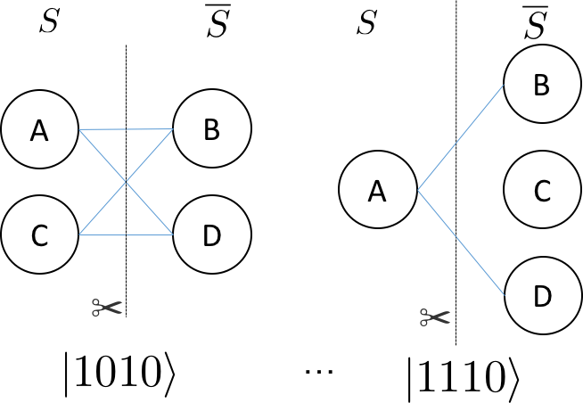
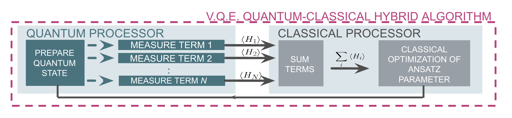
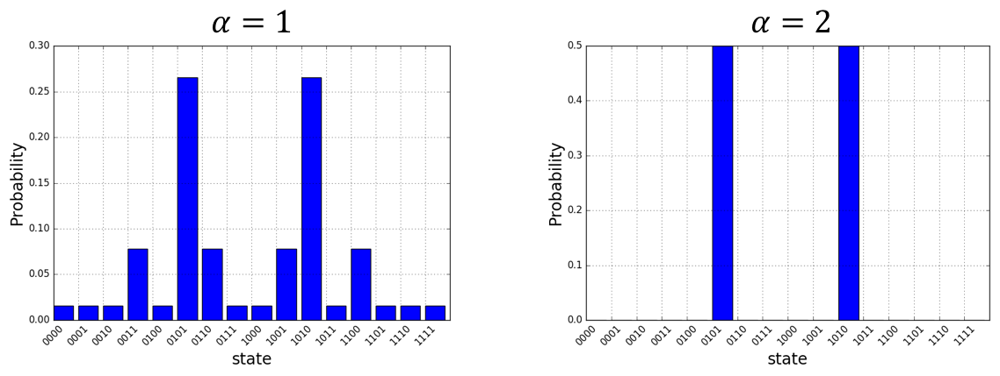
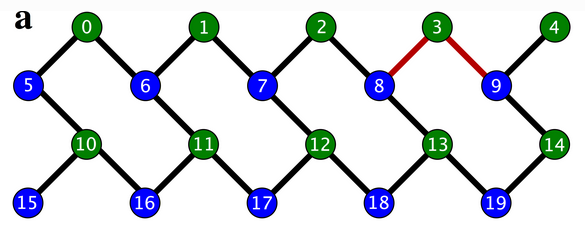

Quantum Approximate Optimization Algorithm (QAOA)
=================================================

Overview
--------

pyQAOA is a Python module for running the Quantum Approximate Optimization
Algorithm on an instance of a quantum abstract machine.

The pyQAOA package contains separate modules for each type of problem
instance: MAX-CUT, graph partitioning, etc.
For each problem instance the user specifies the driver Hamiltonian,
cost Hamiltonian, and the approximation order of the algorithm.

``qaoa.py`` contains the base QAOA class and routines for finding optimal
rotation angles via Grove's
`variational-quantum-eigensolver method <http://grove-docs.readthedocs.io/en/latest/vqe.html>`_.

Cost Functions
--------------

* ``maxcut_qaoa.py`` implements the cost function for MAX-CUT problems.

* ``numpartition_qaoa.py`` implements the cost function for bipartitioning a list of numbers.

.. _quickstart-example:

Quickstart Examples
-------------------

To test your installation and get going we can run QAOA to solve MAX-CUT on a square ring with
4 nodes at the corners. In your python interpreter import the packages and connect to your QVM:

.. code-block:: python

    import numpy as np
    from grove.pyqaoa.maxcut_qaoa import maxcut_qaoa
    import pyquil.api as api
    qvm_connection = api.QVMConnection()

Next define the graph on which to run MAX-CUT

.. code-block:: python

    square_ring = [(0,1),(1,2),(2,3),(3,0)]

The optional configuration parameter for the algorithm is given by the number of
steps to use (which loosely corresponds to the accuracy of the optimization computation).
We instantiate the algorithm and run the optimization routine on our QVM:

.. code-block:: python

    steps = 2
    inst = maxcut_qaoa(graph=square_ring, steps=steps)
    betas, gammas = inst.get_angles()

to see the final \\(\\mid \\beta, \\gamma \\rangle \\) state we can rebuild the
quil program that gives us \\(\\mid \\beta, \\gamma \\rangle \\)  and evaluate the wave function using the QVM

.. code-block:: python

    t = np.hstack((betas, gammas))
    param_prog = inst.get_parameterized_program()
    prog = param_prog(t)
    wf = qvm_connection.wavefunction(prog)
    wf = wf.amplitudes

``wf`` is now a numpy array of complex-valued amplitudes for each computational
basis state.  To visualize the distribution iterate over the states and
calculate the probability.

.. code-block:: python

    for state_index in range(2**inst.n_qubits):
        print(inst.states[state_index], np.conj(wf[state_index])*wf[state_index])

You should then see that the algorithm converges on the expected solutions of 0101 and 1010! ::

    0000 (4.38395094039e-26+0j)
    0001 (5.26193287055e-15+0j)
    0010 (5.2619328789e-15+0j)
    0011 (1.52416449345e-13+0j)
    0100 (5.26193285935e-15+0j)
    0101 (0.5+0j)
    0110 (1.52416449362e-13+0j)
    0111 (5.26193286607e-15+0j)
    1000 (5.26193286607e-15+0j)
    1001 (1.52416449362e-13+0j)
    1010 (0.5+0j)
    1011 (5.26193285935e-15+0j)
    1100 (1.52416449345e-13+0j)
    1101 (5.2619328789e-15+0j)
    1110 (5.26193287055e-15+0j)
    1111 (4.38395094039e-26+0j)

Algorithm and Details
---------------------

Introduction
~~~~~~~~~~~~

The quantum-approximate-optimization-algorithm (QAOA, pronouced quah-wah),
developed by Farhi, Goldstone, and Gutmann, is a polynomial time
algorithm for finding "a 'good' solution to an optimization problem"
[`1 <https://arxiv.org/abs/1602.07674>`_, `2 <https://arxiv.org/abs/1411.4028>`_].

What's with the name? For a given NP-Hard problem an approximate algorithm is a
polynomial-time algorithm that solves every instance of the problem with some
guaranteed quality in expectation.  The value of merit is the ratio between the quality of
the polynomial time solution and the quality of the true solution.

One reason QAOA is interesting is its potential to exhibit quantum supremacy
[`1 <https://arxiv.org/abs/1602.07674>`_].

This package, which is an implementation of QAOA that runs
on a simulated quantum computer, can be used as a stand alone optimizer or a plugin
optimization routine in a larger environment.  The usage pipeline is as
follows: 1) encoding the cost function into a set of Pauli operators,
2) instantiating the problem with pyQAOA and pyQuil, and 3) retrieving ground state solution by sampling.

The following section of the pyQAOA documentation describes the algorithm
and the NP-hard problem instance used in the original paper.

Our First NP-Hard Problem
~~~~~~~~~~~~~~~~~~~~~~~~~

The maximum-cut problem (MAX-CUT) was the first application described in the
original quantum-approximate-optimization-algorithm paper [`2
<https://arxiv.org/abs/1411.4028>`_ ].  This problem is similar to graph coloring.
Given a graph of nodes and edges, color each node black or white, then score a point
for each node that is next to a node of a different color. The aim is to find a coloring
that scores the most points.

Stated a bit more formally, the problem is to partition the
nodes of a graph into two sets such that the number of edges connecting nodes in
opposite sets is maximized.  For example, consider the barbell graph

there are 4 ways of  partitioning nodes into two sets:

We have drawn the edge only when it connects nodes in different sets.  The line
with the scissor symbol indicates that we count the edge in our cut.  For the
barbell graph there are two equal weight partitionings that correspond to a
maximum cut (the right two
partitonings)--i.e. cutting
the barbell in half.  One can denote which set \\( S \\) or \\( \\overline{S}
\\) a node is in with either a \\(0\\) or a \\(1\\), respectively, in a bit
string of length  \\( N \\).  The four partitionings of the barbell graph listed
above are, \\(\\{ 00, 11, 01, 10 \\} \\)---where the left most bit is node
\\(A\\) and the right most bit is node \\(B\\).  The bit string representation
makes it easy to represent a particular partition of the graph.  Each bit
string has an associated cut weight.

For any graph, the bit string representations of the node partitionings are always
length \\(N\\). The total number of partitionings grows as \\(2^{N}\\).  For
example, a square ring graph

has 16 possible partitions (\\(2^{4}\\)).  Below
are two possible ways of parititioning of the nodes.

The bit strings associated with each parititioning are indicated in the figure.  The
right most bit corresponds with the node labeled \\(A\\) and the left most bit
corresponds with the node labeled \\(D\\).

Classical Solutions
~~~~~~~~~~~~~~~~~~~

In order to find the best cut on a classical computer the obvious approach is to
enumerate all partitions of the graph and check the weight of the cut associated with the
partition.

Faced with an exponential cost for finding the optimal cut (or set of optimal
cuts) one can devise a polynomial algorithm that is guaranteed to be of a
particular quality.  For example, a famous polynomial time algorithm is the
randomized partitioning approach.  One simply iterates over the nodes of the
graph and flips a coin.  If the coin is heads the node is in \\( S \\), if
tails the node is in \\( \\overline{S} \\).  The quality of the random
assignment algorithm is at least 50 percent of the maximum cut.
For a coin-flip process the probability of an edge being in the cut is 50\%.
Therefore, the expectation value of a cut produced by random assignment can be
written as follows:
$$\\sum_{e \\in E} w_{e} \\cdot \\mathrm{Pr}(e \\in \\mathrm{cut}) =
\\frac{1}{2} \\sum_{e \\in E}w_{e}$$
Since the sum of all the edges is necessarily an upper bound to the maximum cut
the randomized approach produces a cut of expected value of at least 0.5 times the
best cut on the graph.

Other polynomial approaches exist that involve semi-definite programming which
give cuts of expected value at least 0.87856 times the maximum cut [`3
<http://dl.acm.org/citation.cfm?id=227684>`_].

Quantum Approximate Optimization
~~~~~~~~~~~~~~~~~~~~~~~~~~~~~~~~

One can think of the bit strings (or set of bit strings) that correspond to the
maximum cut on a graph as the ground state of a Hamiltonian encoding
the cost function.  The form of this Hamiltonian can be determined by
constructing the classical function that returns a 1 (or the weight of the edge) if the edge spans two-nodes in different sets, or 0 if the nodes are in the same set.
\\begin{align}
C_{ij} = \\frac{1}{2}(1 - z_{i}z_{j})
\\end{align}
\\( z_{i}\\) or \\(z_{j}\\) is \\(+1\\) if node \\(i\\) or node \\(j\\) is in \\(S\\)
or \\(-1\\) if node \\(i\\) or node \\(j\\) is in \\(\\overline{S}\\). The total cost is the
sum of all \\( (i ,j) \\) node pairs that form the edge set of the graph.
This suggests that for MAX-CUT the Hamiltonian that encodes the problem is
$$\\sum_{ij}\\frac{1}{2}(\\mathbf{I} - \\sigma_{i}^{z}\\sigma_{j}^{z})$$
where the sum is over \\( (i,j) \\) node pairs that form the edges of the graph.
The quantum-approximate-optimization-algorithm relies on the fact that we can
prepare something approximating the ground state of this Hamiltonian and
perform a measurement on that state. Performing a measurement on the \\(N\\)-body
quantum state returns the bit string corresponding to the maximum cut with high
probability.

To make this concrete let us return to the barbell graph. The graph requires two qubits
in order to represent the nodes.  The Hamiltonian has the form
\\begin{align}
\\hat{H} = \\frac{1}{2}(\\mathbf{I} - \\sigma_{z}^{1}\\otimes \\sigma_{z}^{0})
= \\begin{pmatrix}
0 & 0 & 0 & 0 \\\\
0 & 1 & 0 & 0 \\\\
0 & 0 & 1 & 0 \\\\
0 & 0 & 0 & 0
\\end{pmatrix}
\\end{align}
where the basis ordering corresponds to increasing integer values in binary format (the left most bit being the most significant).  This corresponds to a basis
ordering for the \\(\\hat{H}\\) operator above as
\\begin{align}
(| 00\\rangle, | 01\\rangle, | 10\\rangle, | 11\\rangle).
\\end{align}
Here the Hamiltonian is diagonal with integer eigenvalues.
Clearly each bit string is an eigenstate of the Hamiltonian because \\(\\hat{H}\\) is diagonal.

QAOA identifies the ground state of the MAXCUT Hamiltonian by
evolving from a reference state.  This reference state is the ground state of
a Hamiltonian that couples all \\( 2^{N} \\) states that form
the basis of the cost Hamiltonian---i.e. the diagonal basis for cost function.
For MAX-CUT this is the \\(Z\\) computational basis.

The  evolution between the ground state of the reference Hamiltonian
and the ground state of the MAXCUT Hamiltonian can be generated by an
interpolation between the two operators
\\begin{align}
\\hat{H}_{\\tau} = \\tau\\hat{H}_{\\mathrm{ref}}  + (1 - \\tau)\\hat{H}_{\\mathrm{MAXCUT}}
\\end{align}
where \\(\\tau\\) changes between 1 and 0. If the ground state of the reference
Hamiltonian is prepared and \\( \\tau = 1\\) the state is
a stationary state of \\(\\hat{H}_{\\tau}\\).  As \\(\\hat{H}_{\\tau}\\) transforms
into the MAXCUT Hamiltonian the ground state will evolve as it is no longer
stationary with respect to \\(\\hat{H}_{\\tau \\neq 1 }\\). This can be thought of
as a continuous version of the of the evolution in QAOA.

The appproximate portion of the algorithm comes from how many values of \\(\\tau\\) are used
for approximating the continuous evolution. We will call this number of slices \\(\\alpha\\).
The original paper [`2 <https://arxiv.org/abs/1411.4028>`_] demonstrated that for \\(\\alpha = 1\\) the optimal
circuit produced a distribution of states with a Hamiltonian expectation value of
0.6924 of the true maximum cut for 3-regular graphs. Furthermore, the ratio between
the true maximum cut and the expectation value from QAOA could be
improved by increasing the number of slices approximating the evolution.

Details
~~~~~~~

For MAXCUT, the reference Hamiltonian is the sum of \\(\\sigma_{x}\\) operators
on each qubit.
\\begin{align}
\\hat{H}_{\\mathrm{ref}} = \\sum_{i=0}^{N-1} \\sigma_{i}^{X}
\\end{align}
This Hamiltonian has a ground state which is the tensor product of the lowest
eigenvectors of the \\(\\sigma_{x}\\) operator (\\(\\mid +
\\rangle\\) ).
\\begin{align}
\\mid \\psi_{\\mathrm{ref}}\\rangle = \\mid + \\rangle_{N-1}\\otimes\\mid +
\\rangle_{N-2}\\otimes...\\otimes\\mid + \\rangle_{0}
\\end{align}

The reference state is easily generated by performing a Hadamard gate on each
qubit--assuming the initial state of the system is all zeros.  The Quil code
generating this state is

.. code-block:: c

    H 0
    H 1
    ...
    H N-1

pyQAOA requires the user to input how many
slices (approximate steps) for the evolution between the reference and MAXCUT
Hamiltonian.  The algorithm then variationally
determines the parameters for the rotations (denoted \\(\\beta\\) and
\\(\\gamma\\))
using the quantum-variational-eigensolver method [`4
<http://arxiv.org/abs/1509.04279>`_][`5 <http://arxiv.org/abs/1304.3061>`_]
that maximizes the cost function.

For example, if (\\(\\alpha = 2\\)) is selected two unitary operators
approximating the continuous evolution are generated.
\\begin{align}
U = U(\\hat{H}_{\\alpha_{1}})U(\\hat{H}_{\\alpha_{0}})
\\label{eq:evolve}
\\end{align}
Each \\( U(\\hat{H}_{\\alpha_{i}})\\) is approximated by a first order Trotter-Suzuki decomposition with the number of Trotter steps equal to one
\\begin{align}
U(\\hat{H}_{s_{i}}) = U(\\hat{H}_{\\mathrm{ref}}, \\beta_{i})U(\\hat{H}_{\\mathrm{MAXCUT}}, \\gamma_{i})
\\end{align}
where
\\begin{align}
U(\\hat{H}_{\\mathrm{ref}}, \\beta_{i}) = e^{-i \\hat{H}_{\\mathrm{ref}} \\beta_{i}}
\\end{align}
and
\\begin{align}
U(\\hat{H}_{\\mathrm{MAXCUT}}, \\gamma_{i}) = e^{-i \\hat{H}_{\\mathrm{MAXCUT}} \\gamma_{i}}
\\end{align}
\\( U(\\hat{H}_{\\mathrm{ref}}, \\beta_{i}) \\) and \\(  U(\\hat{H}_{\\mathrm{MAXCUT}}, \\gamma_{i})\\) can be expressed as a short quantum circuit.

For the \\(U(\\hat{H}_{\\mathrm{ref}}, \\beta_{i})\\) term (or mixing
term) all operators in the sum commute and thus can be split into a product of
exponentiated \\(\\sigma_{x}\\) operators.
\\begin{align}
e^{-i\\hat{H}_{\\mathrm{ref}} \\beta_{i}} = \\prod_{n =
0}^{1}e^{-i\\sigma_{n}^{x}\\beta_{i}}
\\end{align}

.. code-block:: c

    H 0
    RZ(beta_i) 0
    H 0
    H 1
    RZ(beta_i) 1
    H 1

Of course, if RX is in the natural gate set for the quantum-processor this Quil
is compiled into a set of RX rotations.  The Quil code for the cost function
\\begin{align}
e^{-i \\frac{\\gamma_{i}}{2}(\\mathbf{I} - \\sigma_{1}^{z} \\otimes \\sigma_{0}^{z}) }
\\end{align}
looks like this:

.. code-block:: c

    X 0
    PHASE(gamma{i}/2) 0
    X 0
    PHASE(gamma{i}/2) 0
    CNOT 0 1
    RZ(gamma{i}) 1
    CNOT 0 1

Executing the Quil code will generate the
\\( \\mid + \\rangle_{1}\\otimes\\mid + \\rangle_{0}\\) state and
perform the evolution with selected \\(\\beta\\) and \\(\\gamma\\) angles.
\\begin{align}
\\mid \\beta, \\gamma \\rangle = e^{-i \\hat{H}_{\\mathrm{ref}} \\beta_{1}}e^{-i \\hat{H}_{\\mathrm{MAXCUT}} \\gamma_{1}}e^{-i \\hat{H}_{\\mathrm{ref}} \\beta_{0}}e^{-i \\hat{H}_{\\mathrm{MAXCUT}} \\gamma_{0}} \\mid + \\rangle_{N-1,...,0}
\\end{align}
In order to indentify the set of \\(\\beta\\) and \\(\\gamma\\) angles that
maximize the objective function
\\begin{align}
\\mathrm{Cost} = \\langle \\beta, \\gamma \\mid  \\hat{H}_{\\mathrm{MAXCUT}}
\\mid \\beta, \\gamma \\rangle
\\label{expect}
\\end{align}
pyQAOA leverages the classical-quantum hybrid
approach known as the quantum-variational-eigensolver[`4
<http://arxiv.org/abs/1509.04279>`_][`5 <http://arxiv.org/abs/1304.3061>`_].  The quantum processor
is used to prepare a state through a polynomial number of operations which is
then used to evaluate the cost.  Evaluating the cost
(\\( \\langle \\beta, \\gamma \\mid \\hat{H}_{\\mathrm{MAXCUT}} \\mid \\beta, \\gamma \\rangle\\)) requires
many preparations and measurements to generate enough samples to accurately
construct the distribution.   The classical computer then generates a new set of
parameters (\\( \\beta, \\gamma\\)) for maximizing the cost function.

By allowing variational freedom in the \\( \\beta \\) and \\( \\gamma \\)
angles QAOA finds the optimal path for a fixed
number of steps. Once optimal angles are determined by the classical
optimization loop one can read off the distribution by many preparations of the
state with \\(\\beta, \\gamma\\) and sampling.

The probability distributions above are for the four ring graph discussed earlier.
As expected the approximate evolution becomes more accurate as the number of
steps (\\(\\alpha\\)) is increased.  For this simple model \\(\\alpha = 2\\) is
sufficient to find the two degnerate cuts of the four ring graph.

QPU Embedding
~~~~~~~~~~~~~

If you want to use QAOA with the QPU you most probably want full control
over which qubits are being used. First of all, there might be dead qubits
on the chip that no one should use. Secondly, your QAOA implementation might
only require five qubits to run in which case you should try to select a subset
of qubits that is in close proximity on the chip (to decrease the number of
topological SWAPs) and which has the best specs. You can manually select the
physical qubits by using the ``embedding`` argument when instantiating your
QAOA instance. In this example, we will solve the same square ring Max-CUT
problem as in the :ref:`quickstart-example`. To solve this problem, we require
four qubits. Let's have a look at the hardware graph of the 19Q-Acorn chip:

We certainly don't want to use qubits 3 and 15 which are currently turned off. After looking at
the decoherence times in the  `PyQuil documentation <http://pyquil.readthedocs.io/en/latest/qpu.html>`_
we decide to use the qubits \\(0, 6, 1\\) and \\(7\\) (for this example we want to keep the indices
small). Next to the square ring graph we can now define the ``embedding``:

.. code-block:: python

    import numpy as np
    from grove.pyqaoa.maxcut_qaoa import maxcut_qaoa
    import pyquil.api as api

    qvm_connection = api.QVMConnection()

    square_ring = [(0,1),(1,2),(2,3),(3,0)]
    embedding = {0: 0, 1: 6, 2: 7, 3: 1}

We instantiate the algorithm, this time with the optional ``embedding`` argument and run
the optimization routine on our QVM:

.. code-block:: python

    steps = 2
    inst = maxcut_qaoa(graph=square_ring, steps=steps, embedding=embedding)
    betas, gammas = inst.get_angles()

And let's visualize the wavefunction again:

.. code-block:: python

    t = np.hstack((betas, gammas))
    param_prog = inst.get_parameterized_program()
    prog = param_prog(t)
    wf = qvm_connection.wavefunction(prog)
    wf = wf.amplitudes

    for state_index in range(2**4):
        print(inst.states[state_index], np.conj(wf[state_index])*wf[state_index])

You should then see that the algorithm converges on the solutions of \\(0110\\) and \\(1001\\)! ::

    0000 (5.708663566132753e-10+0j)
    0001 (7.764079130797125e-06+0j)
    0010 (7.764079130796849e-06+0j)
    0011 (1.432693478156927e-06+0j)
    0100 (7.764079130797427e-06+0j)
    0101 (1.4326934781570087e-06+0j)
    0110 (0.4999660777256528+0j)
    0111 (7.764079130797218e-06+0j)
    1000 (7.764079130797218e-06+0j)
    1001 (0.4999660777256528+0j)
    1010 (1.4326934781570087e-06+0j)
    1011 (7.764079130797427e-06+0j)
    1100 (1.432693478156927e-06+0j)
    1101 (7.764079130796849e-06+0j)
    1110 (7.764079130797125e-06+0j)
    1111 (5.708663566132753e-10+0j)

If you compare this with the solution in the :ref:`quickstart-example` you will realize that the solutions
don't match up. The reason for this is that we have to *unembed* our solution. The QPU/QVM returns the bits
ordered in reverse order depending on the indices of the physical qubits (the values in the ``embedding`` dict).
Hence, the solution 0110 string must be read as \\(q_{7}q_{6}q_{1}q_{0}\\). Unembedding means applying the
transforms \\(q_{7}\\rightarrow q_{2}, q_{6} \\rightarrow q_{1}, q_{1} \\rightarrow q_{3}, q_{0}\\rightarrow q_{0} \\).
The order of the returned solution string is then \\(q_{2}q_{1}q_{3}q_{0}\\) which is obviously not correctly ordered.
Thus, it remains to correctly order the bits by reverse indices such that we get \\(q_{3}q_{2}q_{1}q_{0}\\). The first
unembedded solution \\(0110\\) then reads \\(0101\\) and the other unembedded solution \\(1001\\) becomes \\(1010\\) which are
the same solutions that we obtained in the :ref:`quickstart-example`!

Conveniently, if you use the ``get_string`` method on the QAOA instance the unembedding happens without you
even having to worry about it! You pass the embedding when instantiating the QAOA instance and you will never
ever have to think in terms of the physical qubit indices since the solution string will be ordered in reverse
order of your logical qubits! Everything is as if you've never did an embedding.

Source Code Docs
----------------

Here you can find documentation for the different submodules in pyQAOA.

grove.pyqaoa.qaoa
~~~~~~~~~~~~~~~~~

.. automodule:: grove.pyqaoa.qaoa
    :members:
    :undoc-members:
    :show-inheritance:

grove.pyqaoa.maxcut_qaoa
~~~~~~~~~~~~~~~~~~~~~~~~

.. automodule:: grove.pyqaoa.maxcut_qaoa
    :members:
    :undoc-members:
    :show-inheritance:

grove.pyqaoa.numpartition_qaoa
~~~~~~~~~~~~~~~~~~~~~~~~~~~~~~

.. automodule:: grove.pyqaoa.numpartition_qaoa
    :members:
    :undoc-members:
    :show-inheritance:
