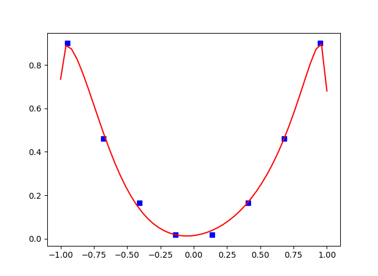
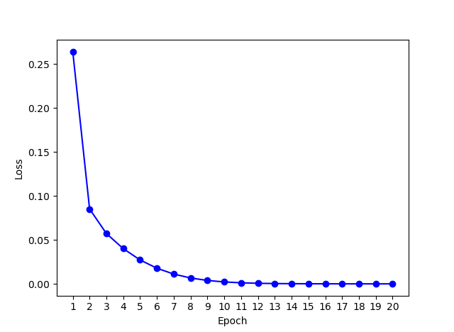
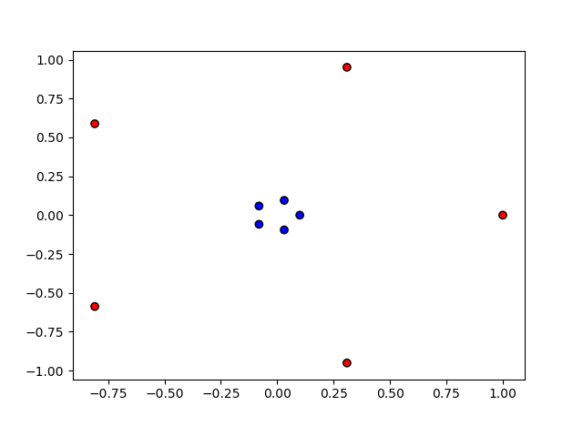
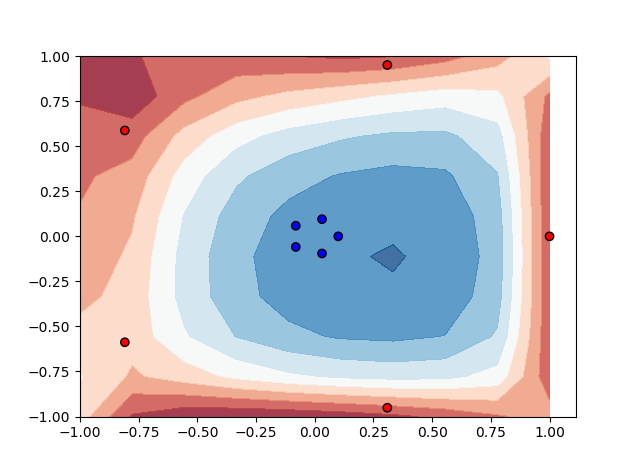

Quantum-Circuit-Learning (QCL)
=====================================

Overview
--------

The Quantum-Circuit-Learning  (QCL) [`1 <https://arxiv.org/abs/1803.00745>`_] is a quantum/classical hybrid algorithm that aims to perform supervised or unsupervised learning tasks. In supervised tasks, the algorithm is supplied with data :math:`\{x_i\}` and corresponding labels :math:`\{y_i\}`. Then, the algorithm learns to output :math:`\{f(x_i,\theta)\}` which is as close as possible to testing labels, not used in training. In this hybrid algorithm a quantum subroutine calculates the output :math:`\{f(x_i,\theta)\}`, whereas the optimization of :math:`\theta` is executed in a classical optimization loop.

The outline of the algorithm for :math:`N`-qubits circuit is as follows:

1. **Encode input data** :math:`\{x_i\}` into a quantum state :math:`|\Psi_{in}(x_i)\rangle` applying some unitary transformation       :math:`\U(x_i)}` to initialized qubits :math:`|0\rangle`.
   
2. Apply :math:`\theta`-parametrized unitary on input state :math:`|\Psi_{in}(x_i)\rangle` and **generate output state** :math:`U(\theta)|\Psi_{in}(x_i)\rangle=|\Psi_{out}(x_i,\theta)\rangle`.
   
3. Measure the **expectation values** of a subset of Pauli operators :math:`\{B\} \subset \{I,X,Y,Z\}^N`.

4. If necessary, make a transformation of expectation value by some function :math:`F` and calculate an **output** :math:`\{f(x_i,\theta)\}=F(\langle B(x_i,\theta) \rangle)`. 

5. Calculate **loss** :math:`L{y_i,f(x_i,\theta))` and **minimize** it using classical optimization algorithm such as gradient descend.

The quantum subroutine of QCL amounts to encoding an input data into a quantum state, applying an :math:`\theta`-parametrized unitary and calculating expectation values for each training sample. Additionally, a gradient descend method requires to calculate gradients, which are also obtained by calculation of two expectation values :math:`\frac{\partial \langle B \rangle}{\partial \theta_j}=\frac{\langle B \rangle^{+}-\langle B \rangle^{-}}{2}`. 
To calculate :math:`\langle B \rangle^{\pm}`, one has to modify the output state by inserting :math:`\pm \frac{\pi}{2}` rotations 
next to the :math:`\theta_j`-dependend unitary :math:`U_j(theta_j)` (assuming that :math:`U(\theta)` consists of 
a chain of unitary transformatiosn :math:`\{U_j(theta_j)\}`. For more details see the original paper [`1 <https://arxiv.org/abs/1803.00745>`_].

Below there are simple examples of regression task and classification task presented.

Regression example
-----------

In this example, QCL will try to learn a simple quadratic function :math:`x^2`.

Firstly, we generate a small dataset:

.. code:: python

   import numpy as np

   np.random.seed(0)
   m = 8
   X = np.linspace(-0.95,0.95,m)
   y = X**2

Next thing is to write a pyQuil program that encodes input data into a quantum state :math:`|\Psi_{in}(x_i)\rangle`.
We will do that applying :math:`R^X(\cos(x^2))R^Y(\sin(x))` gate on each qubit in :math:`N=3`-qubits quantum circuit. 

.. code:: python

   import pyquil.quil as pq
   from pyquil.gates import RX, RY, RZ
   
   n_qubits = 3
   def input_prog(sample):
       p = pq.Program()
       for j in range(n_qubits):
           p.inst(RY(np.arcsin(sample[0]), j))
           p.inst(RZ(np.arccos(sample[0]**2), j))
       return p 

The output program is generated by evolving quantum system accordingly to a fully connected transverse Ising model Hamilonian 
and then applying :math:`R^X(\theta_{j,1})R^Z(\theta_{j,2})R^X(\theta_{j,3})` gate on each qubit. This procedure is reapeated :math:`D` times to increase the learning capacity of QCL. The Ising model Hamiltonian is expressed by following formula:

:math:`H = \sum{j=1}{N}h_j X_j + \sum{j=1}{N}\sum{k=1}{j-1}J_{jk}Z_j Z_k`

and then the evolution with time :math:`T=10` is expressed by :math:`\exp(-iTH)`. The dynamics of this Hamiltonian generates a highly entangled state and is a key ingredient to successfully learn an output. To generate a Quil program responsible for the approximation of Ising model evolution we use a helper function:

.. code:: python

   from grove.pyqcl.qcl import ising_prog_gen 
   ising_prog = ising_prog_gen(trotter_steps=1000, T=10, n_qubits=n_qubits)

The output state is generated with the following function (:math:`D` is denoted here by depth variable):

.. code:: python

   depth = 3   
   def output_prog(theta):
       p = pq.Program()
       theta = theta.reshape(3,n_qubits,depth)
       for i in range(depth):
           p += ising_prog
           for j in range(n_qubits):
               p.inst(RX(theta[0,j,i], j))
               p.inst(RZ(theta[1,j,i], j))
               p.inst(RX(theta[2,j,i], j))
       return p

The last thing is to write a function generating Quil program responsible for gradient calculations accordingly to formulas presented in the paper. This is done by inserting :math:`\pm \frac{\pi}{2}` rotations:

.. code:: python

   def grad_prog(theta, idx, sign):
       theta = theta.reshape(3,n_qubits,depth)
       idx = np.unravel_index(idx, theta.shape)
       p = pq.Program()
       for i in range(depth):
           p += ising_prog
           for j in range(n_qubits):
               p.inst(RX(theta[0,j,i], j))
               if idx == (0,j,i):
                   p.inst(RX(sign*np.pi/2.0, j))
               p.inst(RZ(theta[1,j,i], j))
               if idx == (1,j,i):
                   p.inst(RZ(sign*np.pi/2.0, j))
               p.inst(RX(theta[2,j,i], j))
               if idx == (2,j,i):
                   p.inst(RX(sign*np.pi/2.0, j))
       return p

Now, it is time to run QCL. We initialize :math:`\theta` parameters with random numbers drawn from uniform distribution on :math:`[0,2*\pi]`. The output is taken from :math:`Z` expectation values on the first qubit and we use mean squared error as a loss function minimized. A number of training iterations (epochs) is set to :math:`20` and we use full-batch gradient descend. For mean squared error loss function, the expectation value is multiplied by a coefficient which is also optimized, however, this is done inside the code. The aim of this multiplication is to scale the expectation value. 

.. code:: python

   import pyquil.api as api
   from pyquil.gates import Z
   from grove.pyqcl.qcl import QCL

   qvm = api.QVMConnection()

   state_generators = dict()
   state_generators['input'] = input_prog
   state_generators['output'] = output_prog
   state_generators['grad'] = grad_prog

   initial_theta = np.random.uniform(0.0, 2*np.pi, size=3*n_qubits*depth)

   operator = [pq.Program(Z(n_qubits-1))] 
   est = QCL(state_generators, initial_theta, loss="mean_squared_error",  
             operator_programs=operator, epochs=20, batch_size=m,
             verbose=True, qvm=qvm)

We fit a QCL estimator based on our data and labels, get the results for inspection and predict to produce a plot.
(Training can take a while as :math:`3*n_qubits*depth*m*3*epochs=12960` expectation values need to be simulated on QVM machine.)

.. code:: python
   est.fit(X,y)
   results = est.get_results()

   X_test = np.linspace(-1.0,1.0,50)
   y_pred = est.predict(X_test)

   import matplotlib.pyplot as plt
   plt.plot(X, y, 'bs', X_test,  y_pred, 'r-')

As we see the QCL fits nicely to the data. Assuming, we have a real quantum computer, we can increase significantly number of qubits, depth and number of samples to cope with more complex regression tasks.

History of loss values is presented in the plot below.

    
Classification example
-----------

In this example, QCL will try to perform a simple nonlinear classification task. The data points belong to two classes 0 (red dots) and 1 (blue dots).

The algorithm structure is very similar to the QCL regression example. We generate a data with sklearn make_circles method:

.. code:: python
   from sklearn.datasets import make_circles
   np.random.seed(0)
   m = 10
   X, y = make_circles(n_samples=m, factor=.1, noise=.0, random_state=0)

Next, we produce a function generating input, output and gradient states. The default methods of QCL can be used.

.. code:: python
   from grove.pyqcl.qcl import (ising_prog_gen, default_input_state_gen, 
                    default_output_state_gen, default_grad_state_gen)

   n_qubits, depth = 4, 4

   ising_prog = ising_prog_gen(trotter_steps=1000, T=10, n_qubits=n_qubits)
   state_generators = dict()
   state_generators['input'] = default_input_state_gen(n_qubits)
   state_generators['output'] = default_output_state_gen(ising_prog, n_qubits, depth)
   state_generators['grad'] = default_grad_state_gen(ising_prog, n_qubits, depth)

We increase the number of qubits and depth of quantum circuit in comparison to regression task to get a better fit. The output is taken from :math:`Z` expectation values on the first and second qubit and we use binary crossentropy as a loss function minimized. A number of training iterations (epochs) is set to :math:`20` and we use full-batch gradient descend. For binary crossentropy loss function the expectation values are transformed by softmax function to get valid probabilities, however, this is done inside the code.
(Training can take a while as many expectation values need to be simulated on QVM machine.)

.. code:: python
   initial_theta = np.random.uniform(0.0, 2*np.pi, size=3*n_qubits*depth)
   operator = [pq.Program(Z(n_qubits-1)), pq.Program(Z(n_qubits-2))] 
   est = QCL(state_generators, initial_theta, loss="binary_crossentropy",  
             operator_programs=operator, epochs=20, batch_size=m,
             verbose=True, qvm=qvm)

   est.fit(X,y)
   results = est.get_results()

Now, we can plot the decision surface of a fitted QCL estimator:

.. code:: python
   import matplotlib.pyplot as plt
   from matplotlib.colors import ListedColormap
   cm = plt.cm.RdBu
   cm_bright = ListedColormap(['#FF0000', '#0000FF'])
   xx, yy = np.meshgrid(np.linspace(-1.0, 1.0, 10),
                        np.linspace(-1.0, 1.0, 10))
   y_pred = est.predict(np.c_[xx.ravel(), yy.ravel()])[:,0]
   Z = y_pred.reshape(xx.shape)
   plt.contourf(xx, yy, Z, cmap=cm, alpha=.8)
   plt.scatter(X[:, 0], X[:, 1], c=y, cmap=cm_bright, edgecolors='k')

As we see the QCL fits sufficiently to the data. We can increase the predictive force by increasing number of qubits and depth of quantum circuit.

    
Links and Further Reading
-------------------------

This concludes our brief introduction to QCL. There are many areas of machine learning in which QCL can used, thus if you have ideas how to expand the algorithm feel free to make suggestions.

Link to the original paper:

- `Quantum Circuit Learning <https://arxiv.org/abs/1803.00745>`_

Source Code Docs
----------------

Here you can find documentation for the different submodules in pyQCL.

grove.pyqcl.qcl
~~~~~~~~~~~~~~~

.. automodule:: grove.pyqcl.qcl
    :members:
    :undoc-members:
    :show-inheritance:

grove.pyqcl.optimizer
~~~~~~~~~~~~~~~

.. automodule:: grove.pyqcl.optimizer
    :members:
    :undoc-members:
    :show-inheritance:
