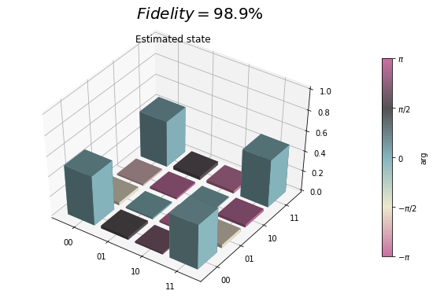
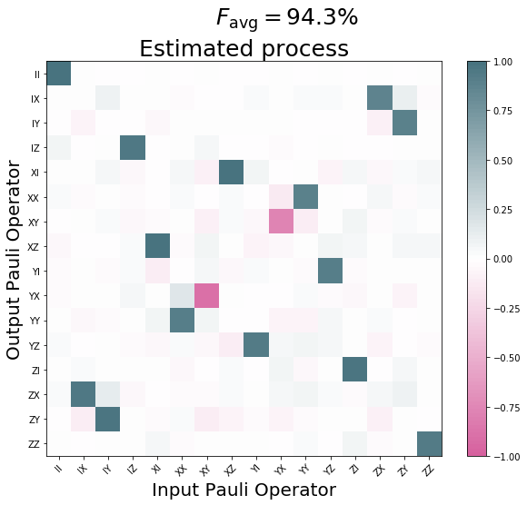

Histogram based Tomography
==========================

Introduction
------------

Quantum states generally encode information about several different mutually incompatible
(non-commuting) sets of observables. A given quantum process including final measurement of all
qubits will therefore only yield partial information about the pre-measurement state even
if the measurement is repeated many times.

To access the information the state contains about other, non-compatible observables, one can
apply unitary rotations before measuring. Assuming these rotations are done perfectly,
the resulting measurements can be interpreted being of the un-rotated state but with rotated
observables.

Quantum tomography is a method that formalizes this procedure and allows to use a complete or
overcomplete set of pre-measurement rotations to fully characterize all matrix elements of the
density matrix.

Example
-------

Consider a density matrix :math:`\rho=\begin{pmatrix} 0.3 & 0.2i\\ -0.2i & 0.7\end{pmatrix}`.

Let us assume that our quantum processor's projective measurement yields perfect outcomes `z` in the
`Z` basis, either `z=+1` or `z=-1`. Then the density matrix :math:`\rho` will give outcome `z=+1`
with probability `p=30%` and `z=-1` with `p=70%`, respectively. Consequently, if we repeat the
`Z`-measurement many times, we can estimate the diagonal coefficients of the density matrix.
To access the off-diagonals, however, we need to measure different observables such as `X` or `Y`.

If we rotate the state as :math:`\rho\mapsto U\rho U^\dagger` and then do our usual `Z`-basis
measurement, then this is equivalent to rotating the measured observable as
:math:`Z \mapsto U^\dagger Z U` and keeping our state :math:`\rho` unchanged. This second point
of view then allows us to see that if we apply a rotation such as :math:`U=R_y(\pi/2)` then this
rotates the observable as :math:`R_y(-\pi/2)ZR_y(+\pi/2)=\cos(\pi/2) Z - \sin(\pi/2) X = -X`.
Similarly, we could rotate by :math:`U=R_x(\pi/2)` to measure the `Y` observable.
Overall, we can construct a sequence of different circuits with outcome statistics that depend on
all elements of the density matrix and that allow to estimate them using techniques such as maximum
likelihood estimation ([MLE]_).

We have visualized this in :ref:`Figure 1 <state-tomo-fig>`.

.. _state-tomo-fig:

    **Figure 1:** This upper half of this diagram shows a simple 2-qubit quantum program consisting
    of both qubits initialized in the :math:`\ket{0}` state, then transformed to some other state
    via a process :math:`V` and finally measured in the natural qubit basis.

On occasion we may also wish to estimate precisely what physical process a particular control/gate
sequence realizes. This is done by a slight extension of the above scheme that also introduces
pre-rotations that prepare different initial states, then act on these with the unknown map
:math:`V` and finally append post-rotations to fully determine the state that each initial state was
mapped to. This is visualized in :ref:`Figure 2 <process-tomo-fig>`.

.. _process-tomo-fig:

    **Figure 2:** For process tomography, rotations must be prepended and appended to fully resolve
    the action of `V` on arbitrary initial states.

The following sections formally define and introduce our tomography methods in full technical
detail. Grove also contains an `example notebook <https://github.com/rigetticomputing/grove/blob/master/examples/Tomography.ipynb>`_
with tomography results obtained from the QPU. A rendered version of this can be found in example_code_.

Useful notation and definitions
-------------------------------

In the following we use ‘super-ket’ notation
:math:`{\left|\left. \rho \right\rangle\!\right\rangle} := {\text{vec}\left(\hat\rho\right)}`
where :math:`{\text{vec}\left(\hat\rho\right)}` is a density operator
:math:`\hat\rho` collapsed to a single vector by stacking its columns.
The standard basis in this space is given by
:math:`\{{\left|\left. j \right\rangle\!\right\rangle},\; j=0,1,2\dots, d^2-1\}`,
where :math:`j=f(k,l)` is a multi-index enumerating the elements of a
:math:`d`-dimensional matrix row-wise, i.e.
:math:`j=0 \Leftrightarrow (k,l)=(0,0)`,
:math:`j=1 \Leftrightarrow (k,l)=(0,1)`, etc. The super-ket
:math:`{\left|\left. j \right\rangle\!\right\rangle}` then corresponds
to the operator :math:`\ket{k}\bra{l}`.

We similarly define
:math:`{\left\langle\!\left\langle \rho \right.\right|} := {\text{vec}\left(\hat\rho\right)}^\dagger`
such that the inner product
:math:`{\left\langle\!\left\langle \chi | \rho \right\rangle\!\right\rangle} = {\text{vec}\left(\hat\chi\right)}^\dagger {\text{vec}\left(\hat\rho\right)} = \sum_{j,k=0}^{d^2-1} \chi_{jk}^\ast\rho_{jk} = {\mathrm{Tr}\left(\hat{\chi}^\dagger \hat\rho\right)}`
equals the Hilbert-Schmidt inner product. If :math:`\rho` is a physical
density matrix and :math:`\hat{\chi}` a Hermitian observable, this also
equals its expectation value. When a state is represented as a
super-ket, we can represent super-operators acting on them as
:math:`\Lambda \to \tilde{\Lambda}`, i.e., we write
:math:`{\left|\left. \Lambda(\hat\rho) \right\rangle\!\right\rangle} = \tilde{\Lambda}{\left|\left. \rho \right\rangle\!\right\rangle}`.

We introduce an orthonormal, Hermitian basis for a single qubit in terms
of the Pauli operators and the identity
:math:`{\left|\left.  P_j \right\rangle\!\right\rangle} := {\text{vec}\left(\hat P_j\right)}`
for :math:`j=0,1,2,3`, where :math:`\hat P_0 = \mathbb{\hat I}/\sqrt{2}`
and :math:`\hat P_k=\sigma_{k}/\sqrt{2}` for :math:`k=1,2,3`. These
satisfy
:math:`{\left\langle\!\left\langle  P_l |  P_m \right\rangle\!\right\rangle}=\delta_{lm}`
for :math:`l,m=0,1,2,3`. For multi-qubit states, the generalization to a
tensor-product basis representation carries over straightforwardly. The
normalization :math:`1/\sqrt{2}` is generalized to :math:`1/\sqrt{d}`
for a d-dimensional space. In the following we assume no particular size
of the system.

We can then express both states and observables in terms of linear
combinations of Pauli-basis super-kets and super-bras, respectively, and
they will have real valued coefficients due to the hermiticity of the
Pauli operator basis. Starting from an initial state :math:`\rho` we can
apply a completely positive map to it

.. math::

   \begin{aligned}
          \hat \rho' = \Lambda_K(\hat\rho) =  \sum_{j=1}^n \hat K_j\hat \rho \hat K_j^\dagger.\end{aligned}

A Kraus map is always completely positive and additionally is trace
preserving if :math:`\sum_{j=1}^n \hat K_j^\dagger \hat K_j = \hat I`.
We can expand a given map :math:`\Lambda(\hat\rho)` in terms of the
Pauli basis by exploiting that
:math:`\sum_{j=0}^{d^2-1} {\left|\left. j \right\rangle\!\right\rangle}{\left\langle\!\left\langle j \right.\right|} = \sum_{j=0}^{d^2-1} {\left|\left. \hat P_j \right\rangle\!\right\rangle}{\left\langle\!\left\langle \hat P_j \right.\right|} = \hat{I}`
where :math:`\hat{I}` is the super-identity map.

For any given map
:math:`\Lambda(\cdot), \mathcal{B} \rightarrow \mathcal{B}`, where
:math:`\mathcal{B}` is the space of bounded operators, we can compute
its Pauli-transfer matrix as

.. math::

   \begin{aligned}
           (\mathcal{R}_\Lambda)_{jk} := {\mathrm{Tr}\left(\hat P_j \Lambda(\hat P_k)\right)},\quad j,k=0,1,,\dots, d^2-1.\end{aligned}

In contrast to [Chow]_, our tomography method
does not rely on a measurement with continuous outcomes but rather
discrete POVM outcomes :math:`j \in \{0,1,\dots, d-1\}`, where :math:`d`
is the dimension of the underlying Hilbert space. In the case of perfect
readout fidelity the POVM outcome :math:`j` coincides with a projective
outcome of having measured the basis state :math:`\ket{j}`. For
imperfect measurements, we can falsely register outcomes of type
:math:`k\ne j` even if the physical state before measurement was
:math:`\ket{j}`. This is quantitatively captured by the readout POVM.
Any detection scheme—including the actual readout and subsequent signal
processing and classification step to a discrete bitstring outcome—can
be characterized by its confusion rate matrix, which provides the
conditional probabilities :math:`p(j|k):= p`\ (detected :math:`j`
:math:`\mid` prepared :math:`k`) of detected outcome :math:`j` given a
perfect preparation of basis state :math:`\ket{k}`

.. math::

   \begin{aligned}
        P = \begin{pmatrix}
               p(0 | 0)   & p(0 | 1)   & \cdots & p(0 | {d-1})  \\
               p(1 | 0)   & p(1 | 1)   & \cdots & p(1 | {d-1})  \\
               \vdots       &              &        & \vdots          \\
               p(d-1 | 0) & p(d-1 | 1) & \cdots & p(d-1 | {d-1})
           \end{pmatrix}.\end{aligned}

The trace of the confusion rate matrix ([ConfusionMatrix]_) divided by the number of states
:math:`F:={\mathrm{Tr}\left( P\right)}/d = \sum_{j=0}^{d-1} p(j|j)/d`
gives the joint assignment fidelity of our simultaneous qubit readout
[Jeffrey]_, [Magesan]_. Given the coefficients
appearing in the confusion rate matrix the equivalent readout [POVM]_ is

.. math::

   \begin{aligned}
       \hat N_j := \sum_{k=0}^{d-1} p(j | k) \hat\Pi_{k}\end{aligned}

where we have introduced the bitstring projectors
:math:`\hat \Pi_{k}=\ket{k}\bra{k}`. We can immediately see that
:math:`\hat N_j\ge 0` for all :math:`j`, and verify the normalization

.. math::

   \begin{aligned}
       \sum_{j=0}^{d-1}\hat N_j = \sum_{k=0}^{d-1} \underbrace{\sum_{j=0}^{d-1} p(j | k)}_{1} \hat \Pi_{k}
       = \sum_{k=0}^{d-1} \hat \Pi_{k} = \mathbb{\hat I}\end{aligned}

where :math:`\mathbb{\hat I}` is the identity operator.

State tomography
----------------

For state tomography, we use a control sequence to prepare a state
:math:`\rho` and then apply :math:`d^2` different post-rotations
:math:`\hat R_k` to our state
:math:`\rho \mapsto \Lambda_{R_k}(\hat \rho) := \hat R_k\hat\rho \hat R_k^\dagger`
such that
:math:`{\text{vec}\left(\Lambda_{R_k}(\hat \rho)\right)} = \tilde{\Lambda}_{R_k} {\left|\left. \rho \right\rangle\!\right\rangle}`
and subsequently measure it in our given measurement basis. We assume
that subsequent measurements are independent which implies that the
relevant statistics for our Maximum-Likelihood-Estimator (MLE) are the
histograms of measured POVM outcomes for each prepared state:

.. math::

   \begin{aligned}
           n_{jk} := \text{ number of outcomes } j \text{ for an initial state } \tilde{\Lambda}_{R_k} {\left|\left. \rho \right\rangle\!\right\rangle}\end{aligned}

If we measure a total of :math:`n_k = \sum_{j=0}^{d-1} n_{jk}` shots
for the pre-rotation :math:`\hat R_k` the probability of obtaining the
outcome :math:`h_k:=(n_{0k}, \dots, n_{(d-1)k})` is given by the
multinomial distribution

.. math::

   \begin{aligned}
           p(h_k) = {n_k \choose n_{0k} \; n_{1k} \; \cdots \; \; n_{(d-1)k}} p_{0k}^{n_{0k}} \cdots p_{(d-1)k}^{n_{(d-1)k}},\end{aligned}

where for fixed :math:`k` the vector :math:`(p_{0k},\dots, p_{(d-1)k})`
gives the single shot probability over the POVM outcomes for the
prepared circuit. These probabilities are given by

.. math::

   \begin{aligned}
       \begin{split}
           p_{jk} &:= {\left\langle\!\left\langle N_j \right.\right|}\tilde{\Lambda}_{R_k}{\left|\left. \rho \right\rangle\!\right\rangle} \\
           &= \sum_{m=0}^{d^2-1}\underbrace{\sum_{r=0}^{d^2-1}\pi_{jr}(\mathcal{\hat R}_{k})_{rm}}_{C_{jkm}}\rho_m \\
           &= \sum_{m=0}^{d^2-1} C_{jkm}\rho_m.
       \end{split}\end{aligned}

Here we have introduced
:math:`\pi_{jl}:={\left\langle\!\left\langle  N_j |  P_l \right\rangle\!\right\rangle} = {\mathrm{Tr}\left(\hat N_j \hat P_l\right)}`,
:math:`(\mathcal{R}_{k})_{rm}:= {\left\langle\!\left\langle P_r \right.\right|}\tilde{\Lambda}_{R_k}{\left|\left. P_m \right\rangle\!\right\rangle}`
and
:math:`\rho_m:= {\left\langle\!\left\langle P_m |  \rho \right\rangle\!\right\rangle}`.
The POVM operators :math:`N_j = \sum_{k=0}^{d-1} p(j |k)  \Pi_{k}` are
defined as above.

The joint log likelihood for the unknown coefficients :math:`\rho_m` for
all pre-measurement channels :math:`\mathcal{R}_k` is given by

.. math::

   \begin{aligned}
       \log L (\rho) = \sum_{j=0}^{d-1}\sum_{k=0}^{d^2-1} n_{jk}\log\left(\sum_{m=0}^{d^2-1} C_{jkm} \rho_m\right) + {\rm const}.\end{aligned}

Maximizing this is a convex problem and can be efficiently done even
with constraints that enforce normalization
:math:`{\mathrm{Tr}\left(\rho\right)}=1` and positivity
:math:`\rho \ge 0`.

Process Tomography
------------------

Process tomography introduces an additional index over the pre-rotations
:math:`\hat R_l` that act on a fixed initial state :math:`\rho_0`. The
result of each such preparation is then acted on by the process
:math:`\tilde \Lambda` that is to be inferred. This leads to a sequence
of different states

.. math::

   \begin{aligned}
   \hat \rho^{(kl)}:= \hat R_k\Lambda(\hat R_l \rho_0 \hat R_l^\dagger)\hat R_k^\dagger \leftrightarrow {\left|\left. \rho^{(kl)} \right\rangle\!\right\rangle} = \tilde{\Lambda}_{R_k} \tilde{\Lambda} \tilde{\Lambda}_{R_l}{\left|\left. \rho_0 \right\rangle\!\right\rangle}.\end{aligned}

The joint histograms of all such preparations and final POVM outcomes
is given by

.. math::

   \begin{aligned}
       n_{jkl} := \text{ number of outcomes } j \text{ given input } {\left|\left. \rho^{(kl)} \right\rangle\!\right\rangle}.\end{aligned}

If we measure a total of :math:`n_{kl} = \sum_{j=0}^{d-1} n_{jkl}`
shots for the post-rotation :math:`k` and pre-rotation :math:`l,` the
probability of obtaining the outcome
:math:`m_{kl}:=(n_{0kl}, \dots, n_{(d-1)kl})` is given by the binomial

.. math::

   \begin{aligned}
           p(m_{kl}) = {n_{kl} \choose n_{0kl} \; n_{1kl} \; \cdots \; \; n_{(d-1)kl}} p_{0kl}^{n_{0kl}} \cdots p_{(d-1)kl}^{n_{(d-1)kl}}\end{aligned}

where the single shot probabilities :math:`p_{jkl}` of measuring
outcome :math:`N_j` for the post-channel :math:`k` and pre-channel
:math:`l` are given by

.. math::

   \begin{aligned}
       \begin{split}
           p_{jkl} &:= {\left\langle\!\left\langle N_j \right.\right|}\tilde{\Lambda}_{R_k} \tilde{\Lambda} \tilde{\Lambda}_{R_l}{\left|\left. \rho_0 \right\rangle\!\right\rangle} \\
           &= \sum_{m,n=0}^{d^2-1}\underbrace{\sum_{r,q=0}^{d^2-1}\pi_{jr}(\mathcal{R}_{k})_{rm} (\mathcal{R}_{l})_{nq} (\rho_0)_q}_{B_{jklmn}}(\mathcal{R})_{mn} \\
           &= \sum_{mn=0}^{d^2-1} B_{jklmn}(\mathcal{R})_{mn}
       \end{split}\end{aligned}

where
:math:`\pi_{jl}:={\left\langle\!\left\langle N_j | l \right\rangle\!\right\rangle} = {\mathrm{Tr}\left(\hat N_j \hat P_l\right)}`
and
:math:`(\rho_0)_q := {\left\langle\!\left\langle  P_q | \rho_0 \right\rangle\!\right\rangle} = {\mathrm{Tr}\left(\hat P_q \hat \rho_0\right)}`
and the Pauli-transfer matrices for the pre and post rotations
:math:`R_l` and the unknown process are given by

.. math::

   \begin{aligned}
           (\mathcal{R}_{l})_{nq} &:= {\mathrm{Tr}\left(\hat P_n \hat R_l \hat P_q \hat R_l^\dagger\right)}.\\
           \mathcal{R}_{mn} &:= {\mathrm{Tr}\left(\hat P_m \Lambda(\hat R_n)\right)}.\end{aligned}

The joint log likelihood for the unknown transfer matrix
:math:`\mathcal{R}` for all pre-rotations :math:`\mathcal{R}_l` and
post-rotations :math:`\mathcal{R}_k` is given by

.. math::

   \begin{aligned}
           \log L (\mathcal{R}) = \sum_{j=0}^{d-1} \sum_{kl=0}^{d^2-1} n_{jkl}\log\left(\sum_{mn=0}^{d^2-1} B_{jklmn} (\mathcal{R})_{mn}\right) + {\rm const}.\end{aligned}

Handling positivity constraints is achieved by constraining the
associated Choi-matrix to be positive [Chow]_. We
can also constrain the estimated transfer matrix to preserve the trace
of the mapped state by demanding that
:math:`\mathcal{R}_{0l}=\delta_{0l}`.

You can learn more about quantum channels here: [QuantumChannel]_.

Metrics
-------

Here we discuss some quantitative measures of comparing quantum states and processes.

For states
##########

When comparing quantum states there are a variety of different measures of (in-)distinguishability,
with each usually being the answer to a particular question, such as
"With what probability can I distinguish two states in a single experiment?",
or "How indistinguishable are measurement samples of two states going to be?".

A particularly easy
to compute measure of indistinguishability is given by the quantum state fidelity, which for pure
(and normalized) states is simply given by :math:`F(\phi, \psi)=|\braket{\phi}{\psi}|`.
The fidelity is 1 if and only if the two states are identical up to a scalar factor. It is zero
when they are orthogonal. The generalization to mixed states takes the form

.. math::

    F(\rho, \sigma) := \tr{\sqrt{\sqrt{\rho}\sigma\sqrt{\rho}}}.

Although this is not obvious from the expression it is symmetric under exchange of the states.
Read more about it here: [QuantumStateFidelity]_
Although one can use the *infidelity* :math:`1-F` as a distance measure, it is not a proper metric.
It can be shown, however that the so called Bures-angle :math:`\theta _{{\rho \sigma }}` implicitly
defined via :math:`\cos\theta_{{\rho\sigma}}=F(\rho,\sigma)` does yield a proper metric in the
mathematical sense.

Another useful metric is given by the trace distance ([QuantumTraceDistance]_)

.. math::

    T(\rho,\sigma):={\frac{1}{2}}\|\rho-\sigma\|_{{1}}=
    {\frac{1}{2}}{\mathrm {Tr}}\left[{\sqrt{(\rho-\sigma )^{\dagger}(\rho-\sigma)}}\right],

which is also a proper metric and provides the answer to the above posed question of what the
maximum single shot probability is to distinguish states :math:`\rho` and :math:`\sigma`.

For processes
#############

For processes the two most popular metrics are the average gate fidelity :math:`F_{\rm avg}(P, U)`
of an actual process :math:`P` relative to some ideal unitary gate :math:`U`.
In some sense it measures the average fidelity (over all input states) by which a physical channel
realizes the ideal operation. Given the Pauli transfer matrices :math:`\mathcal{R}_P` and
:math:`\mathcal{R}_U`
for the actual and ideal processes, respectively, the average gate fidelity ([Chow]_) is

.. math::

    F_{\rm avg}(P, U) = \frac{\tr{\mathcal{R}_P^T\mathcal{R}_U}/d + 1}{d+1}

The corresponding infidelity :math:`1-F_{\rm avg}(P, U)` can be seen as a measure of the average
gate error, but it is not a proper metric.

Another popular error metric is given by the diamond distance, which is a proper metric
and has other nice properties that make it mathematically convenient for proving bounds on error
thresholds, etc. It is given by the maximum trace distance between the ideal map and the actual map
over all input states :math:`\rho` that can generally feature entanglement with other
ancillary degrees of freedom that :math:`U` acts trivially on.

.. math::

    d(U,P)_\diamond = \mathrm{max}_\rho T\left((P\otimes I)[\rho], (U\otimes I)[\rho]\right)

In a sense, the diamond distance can be seen as a worst case error metric and it is particularly
sensitive to *coherent* gate error, i.e., errors in which `P` is a (nearly) unitary process but
deviates from `U`. See also these slides by Blume-Kohout et al. for more information [GST]_.

Further resources
-----------------

.. [MLE] https://en.wikipedia.org/wiki/Maximum_likelihood_estimation
.. [Chow] Chow et al. https://doi.org/10.1103/PhysRevLett.109.060501
.. [Jeffrey] Jeffrey et al. https://doi.org/10.1103/PhysRevLett.112.190504
.. [Magesan] Magesan et al. http://dx.doi.org/10.1103/PhysRevLett.114.200501
.. [POVM] https://en.wikipedia.org/wiki/POVM
.. [ConfusionMatrix] https://en.wikipedia.org/wiki/confusion_matrix
.. [QuantumChannel] https://en.wikipedia.org/wiki/Quantum_channel
.. [QuantumStateFidelity] https://en.wikipedia.org/wiki/Fidelity_of_quantum_states
.. [QuantumTraceDistance] https://en.wikipedia.org/wiki/Trace_distance
.. [GST] Blume-Kohout et al. https://www.osti.gov/scitech/biblio/1345878

Run tomography experiments
--------------------------

This is a rendered version of the
`example notebook. <https://github.com/rigetticomputing/grove/blob/master/examples/Tomography.ipynb>`_
and provides some example applications of grove's tomography module.

.. code:: ipython2

    from __future__ import print_function
    import matplotlib.pyplot as plt
    from mock import MagicMock
    import json

    import numpy as np
    from grove.tomography.state_tomography import do_state_tomography
    from grove.tomography.utils import notebook_mode
    from grove.tomography.process_tomography import do_process_tomography

    # get fancy TQDM progress bars
    notebook_mode(True)

    from pyquil.gates import CZ, RY
    from pyquil.api import QVMConnection, QPUConnection, get_devices
    from pyquil.quil import Program

    %matplotlib inline

    NUM_SAMPLES = 2000

    qvm = QVMConnection()
    # QPU
    online_devices = [d for d in get_devices() if d.is_online()]
    if online_devices:
        d = online_devices[0]
        qpu = QPUConnection(d.name)
        print("Found online device {}, making QPUConnection".format(d.name))
    else:
        qpu = QVMConnection()

.. parsed-literal::

    Found online device 19Q-Acorn, making QPUConnection

.. _example_code:

Example Code
############

Create a Bell state
~~~~~~~~~~~~~~~~~~~

.. code:: ipython2

    qubits = [6, 7]
    bell_state_program = Program(RY(-np.pi/2, qubits[0]),
                                 RY(np.pi/2, qubits[1]),
                                 CZ(qubits[0],qubits[1]),
                                 RY(-np.pi/2, qubits[1]))

Run on QPU & QVM, and calculate the fidelity
~~~~~~~~~~~~~~~~~~~~~~~~~~~~~~~~~~~~~~~~~~~~

.. code:: ipython2

    %%time
    print("Running state tomography on the QPU...")
    state_tomography_qpu, _, _ = do_state_tomography(bell_state_program, NUM_SAMPLES, qpu, qubits)
    print("State tomography completed.")
    print("Running state tomography on the QVM for reference...")
    state_tomography_qvm, _, _ = do_state_tomography(bell_state_program, NUM_SAMPLES, qvm, qubits)
    print("State tomography completed.")

.. parsed-literal::

    Running state tomography on the QPU...
    State tomography completed.
    Running state tomography on the QVM for reference...
    State tomography completed.
    CPU times: user 1.18 s, sys: 84.2 ms, total: 1.27 s
    Wall time: 4.6 s

.. code:: ipython2

    state_fidelity = state_tomography_qpu.fidelity(state_tomography_qvm.rho_est)

    if not SEND_PROGRAMS:
        EPS = .01
        assert np.isclose(state_fidelity, 1, EPS)

    qpu_plot = state_tomography_qpu.plot();
    qpu_plot.text(0.35, 0.9, r'$Fidelity={:1.1f}\%$'.format(state_fidelity*100), size=20)

    state_tomography_qvm.plot();

.. image:: _static/tomography/Tomography_7_1.png

Process tomography
##################

Perform process tomography on a controlled-Z (CZ) gate
~~~~~~~~~~~~~~~~~~~~~~~~~~~~~~~~~~~~~~~~~~~~~~~~~~~~~~

.. code:: ipython2

    qubits = [5, 6]
    CZ_PROGRAM = Program([CZ(qubits[0], qubits[1])])
    print(CZ_PROGRAM)

.. parsed-literal::

    CZ 5 6

Run on the QPU & QVM, and calculate the fidelity
^^^^^^^^^^^^^^^^^^^^^^^^^^^^^^^^^^^^^^^^^^^^^^^^

.. code:: ipython2

    %%time
    print("Running process tomography on the QPU...")
    process_tomography_qpu, _, _ = do_process_tomography(CZ_PROGRAM, NUM_SAMPLES, qpu, qubits)
    print("Process tomography completed.")
    print("Running process tomography on the QVM for reference...")
    process_tomography_qvm, _, _ = do_process_tomography(CZ_PROGRAM, NUM_SAMPLES, qvm, qubits)
    print("Process tomography completed.")

.. parsed-literal::

    Running process tomography on the QPU...
    Process tomography completed.
    Running process tomography on the QVM for reference...
    Process tomography completed.
    CPU times: user 16.4 s, sys: 491 ms, total: 16.8 s
    Wall time: 57.4 s

.. code:: ipython2

    process_fidelity = process_tomography_qpu.avg_gate_fidelity(process_tomography_qvm.r_est)

    if not SEND_PROGRAMS:
        EPS = .001
        assert np.isclose(process_fidelity, 1, EPS)

    qpu_plot = process_tomography_qpu.plot();
    qpu_plot.text(0.4, .95, r'$F_{{\rm avg}}={:1.1f}\%$'.format(process_fidelity*100), size=25)

    process_tomography_qvm.plot();

Source Code Docs
----------------

.. automodule:: grove.tomography.tomography
    :members:
    :show-inheritance:

.. automodule:: grove.tomography.state_tomography
    :members:
    :show-inheritance:

.. automodule:: grove.tomography.process_tomography
    :members:
    :show-inheritance:

.. automodule:: grove.tomography.operator_utils
    :members:
    :show-inheritance:

.. automodule:: grove.tomography.utils
    :members:
    :show-inheritance:

