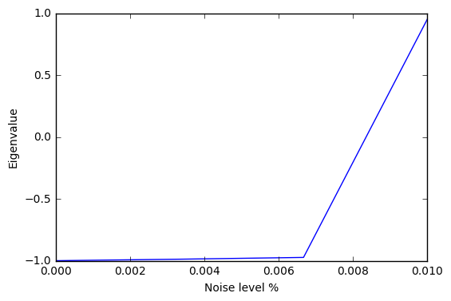

Getting Started with VQE
========================

Here we will take you through an example of a very small variational
quantum eigensolver problem. In this example we will use a quantum
circuit that consists of a single parametrized gate to calculate an
eigenvalue of the Pauli Z matrix.

First we import the necessary pyQuil modules to construct our ansatz
pyQuil program.

.. code:: python

    from pyquil.quil import Program
    import pyquil.forest as forest
    from pyquil.gates import *
    qvm = forest.Connection()

Any Python function that takes a list of numeric parameters and outputs
a pyQuil program can be used as an ansatz function. We will see some more
examples of this later. For now, we just take a parameter list with a
single parameter.

.. code:: python

    def small_ansatz(params):
        return Program(RX(params[0], 0))

    print small_ansatz([1.0])

.. parsed-literal::

    RX(1.0) 0

This ``small_ansatz`` function is our :math:`\Psi(\vec{\theta})`. To
construct the Hamiltonian that we wish to simulate, we use the
``pyquil.paulis`` module.

.. code:: python

    from pyquil.paulis import sZ
    initial_angle = [0.0]
    # Our Hamiltonian is just \sigma_z on the zeroth qubit
    hamiltonian = sZ(0)

We now use the `vqe` module in Grove to construct a ``VQE`` object to perform
our algorithm. In this example, we use ``scipy.optimize.minimize()``
with Nelder-Mead as our classical minimizer, but you can choose other
parameters or write your own minimizer.

.. code:: python

    from grove import VQE
    from scipy.optimize import minimize
    import numpy as np

    vqe_inst = vqe(minimizer=minimize,
                   minimizer_kwargs={'method': 'nelder-mead'})

Before we run the minimizer, let us look manually at what expectation
values
:math:`\langle\,\Psi(\vec{\theta})\,|\,H\,|\,\Psi(\vec{\theta})\,\rangle` we
calculate for fixed parameters of :math:`\vec{\theta}`.

.. code:: python

    angle = 2.0
    vqe_inst.expectation(small_ansatz([angle]), hamiltonian, None, qvm)

.. parsed-literal::

    -0.4161468365471423

The expectation value was calculated by running the pyQuil program output from 
``small_ansatz``, saving the wavefunction, and using that vector to calculate
the expectation value.  We can sample the wavefunction as you would on a
quantum computer by passing an integer, instead of `None`, as the samples
argument of the ``expectation()`` method.

.. code:: python
    
    angle = 2.0
    vqe_inst.expectation(small_ansatz([angle]), hamiltonian, 10000, qvm)
   
.. parsed-literal::

    -0.42900000000000005

We can loop over a range of these angles and plot the expectation value.

.. code:: python

    angle_range = np.linspace(0.0, 2 * np.pi, 20)
    data = [vqe_inst.expectation(small_ansatz([angle]), hamiltonian, None, qvm)
            for angle in angle_range]

    import matplotlib.pyplot as plt
    plt.xlabel('Angle [radians]')
    plt.ylabel('Expectation value')
    plt.plot(angle_range, data)
    plt.show()

.. image:: output_11_0.png
    :align: center

Now with sampling...

.. code:: python

    angle_range = np.linspace(0.0, 2 * np.pi, 20)
    data = [vqe_inst.expectation(small_ansatz([angle]), hamiltonian, 1000, qvm)
            for angle in angle_range]

    import matplotlib.pyplot as plt
    %matplotlib inline
    plt.xlabel('Angle [radians]')
    plt.ylabel('Expectation value')
    plt.plot(angle_range, data)
    plt.show()

We can compare this plot against the value we obtain when we run the our
variational quantum eigensolver.

.. code:: python

    result = vqe_inst.vqe_run(small_ansatz, hamiltonian, initial_angle, None, qvm=qvm)
    print result

.. parsed-literal::

    {'fun': -0.99999999954538055, 'x': array([ 3.1415625])}

Running Noisy VQE
-----------------

A great thing about VQE is that it is somewhat insensitive to noise. We
can test this out by running the previous algorithm on a noisy qvm.

Remember that Pauli channels are defined as a list of three
probabilities that correspond to the probability of a random X, Y, or Z
gate respectively. First we'll study the impact of a channel that has
the same probability of each random Pauli.

.. code:: python

    pauli_channel = [0.1, 0.1, 0.1] #10% chance of each gate at each timestep
    noisy_qvm = forest.Connection(gate_noise=pauli_channel)

Let us check that this QVM has noise:

.. code:: python

    p = Program(X(0), X(1)).measure(0, [0]).measure(1, [1])
    noisy_qvm.run(p, [0, 1], 10)

.. parsed-literal::

    [[1, 1],
     [0, 1],
     [1, 0],
     [0, 1],
     [0, 0],
     [1, 1],
     [0, 1],
     [1, 0],
     [1, 0],
     [0, 1]]

We can run the VQE under noise.  Let's modify the classical optimizer to start
with a larger simplex so we don't get stuck at an initial minimum.

.. code:: python

    vqe_inst.minimizer_kwargs = {'method': 'Nelder-mead', 'options': {'initial_simplex': np.array([[0.0], [0.05]]), 'xatol': 1.0e-2}}
    result = vqe_inst.vqe_run(small_ansatz, hamiltonian, initial_angle, samples=10000, qvm=noisy_qvm)
    print result

.. parsed-literal::

    {'fun': 0.5875999999999999, 'x': array([ 0.01874886])}

10% error is a huge amount of error! We can plot the effect of increasing
noise on the result of this algorithm:

.. code:: python

    data = []
    noises = np.linspace(0.0, 0.01, 4)
    for noise in noises:
        pauli_channel = [noise] * 3
        noisy_qvm = forest.Connection(gate_noise=pauli_channel)
        # We can pass the noise params directly into the vqe_run instead of passing the noisy connection
        result = vqe_inst.vqe_run(small_ansatz, hamiltonian, initial_angle,
                              gate_noise=pauli_channel)
        data.append(result['fun'])

.. code:: python

    plt.xlabel('Noise level %')
    plt.ylabel('Eigenvalue')
    plt.plot(noises, data)
    plt.show()

It looks like this algorithm is pretty robust to noise up until 0.6% error.
However measurement noise might be a different story.

.. code:: python

    meas_channel = [0.1, 0.1, 0.1] #10% chance of each gate at each measurement
    noisy_meas_qvm = forest.Connection(measurement_noise=meas_channel)

Measurement noise has a different effect:

.. code:: python

    p = Program(X(0), X(1)).measure(0, [0]).measure(1, [1])
    noisy_meas_qvm.run(p, [0, 1], 10)

.. parsed-literal::

    [[1, 1],
     [1, 1],
     [1, 1],
     [1, 1],
     [1, 1],
     [1, 1],
     [0, 1],
     [1, 0],
     [1, 1],
     [1, 0]]

.. code:: python

    data = []
    noises = np.linspace(0.0, 0.01, 4)
    for noise in noises:
        meas_channel = [noise] * 3
        noisy_qvm = forest.Connection(measurement_noise=meas_channel)
        result = vqe_inst.vqe_run(small_ansatz, hamiltonian, initial_angle, samples=10000, qvm=noisy_qvm)
        data.append(result['fun'])

.. code:: python

    plt.xlabel('Noise level %')
    plt.ylabel('Eigenvalue')
    plt.plot(noises, data)
    plt.show()

We see this particular VQE algorithm is generally more sensitive to measurement noise than gate noise.

More sophisticated ansatzes
---------------------------

Because we are working with Python, we can leverage the full language to
make much more sophisticated ansatzes for VQE. As an example we can
easily change the number of gates.

.. code:: python

    def smallish_ansatz(params):
        return Program(RX(params[0], 0), RX(params[1], 0))

    print smallish_ansatz([1.0, 2.0])

.. parsed-literal::

    RX(1.0) 0
    RX(2.0) 0

.. code:: python

    vqe_inst = vqe(minimizer=minimize,
                   minimizer_kwargs={'method': 'nelder-mead'})
    initial_angles = [1.0, 1.0]
    result = vqe_inst.vqe_run(smallish_ansatz, hamiltonian, initial_angles, None, qvm=qvm)
    print result

.. parsed-literal::

    {'fun': -1.0000000000000004, 'x': array([ 1.61767133,  1.52392133])}

We can even dynamically change the gates in the circuit based on a
parameterization:

.. code:: python

    def variable_gate_ansatz(params):
        gate_num = int(np.round(params[1])) # for scipy.minimize params must be floats
        p = Program(RX(params[0], 0))
        for gate in range(gate_num):
            p.inst(X(0))
        return p

    print variable_gate_ansatz([0.5, 3])

.. parsed-literal::

    RX(0.5) 0
    X 0
    X 0
    X 0

.. code:: python

    initial_params = [1.0, 3]
    result = vqe_inst.vqe_run(variable_gate_ansatz, hamiltonian, initial_params, None, qvm=qvm)
    print result

.. parsed-literal::

    {'fun': -1.0, 'x': array([  2.65393312e-09,   3.42891875e+00])}

Note that the restriction that the ansatz function take a single list of
floats as parameters only comes from our choice of minimizer (this is
what ``scipy.optimize.minimize`` takes). One could easily imagine
writing a custom minimizer that takes more sophisticated forms of
arguments.

Links and further reading
-------------------------

This concludes our brief tour of VQE. There is a lot of fascinating
literature about this algorithm out there and we encourage you to both
explore those topics as well as come up with new ideas using this
library. Let us know if you have ideas about anything that you would like to
see added!

Here are some links to get you started:

- `A variational eigenvalue solver on a quantum processor <https://arxiv.org/abs/1304.3061>`_

- `The theory of variational hybrid quantum-classical algorithms <https://arxiv.org/abs/1304.3061>`_

- `Hybrid Quantum-Classical Approach to Correlated Materials <https://arxiv.org/abs/1510.03859>`_

- `A Hybrid Classical/Quantum Approach for Large-Scale Studies of Quantum Systems with Density Matrix Embedding Theory <https://arxiv.org/abs/1610.06910>`_

- `Hybrid Quantum-Classical Hierarchy for Mitigation of Decoherence and Determination of Excited States <https://arxiv.org/abs/1603.05681>`_

